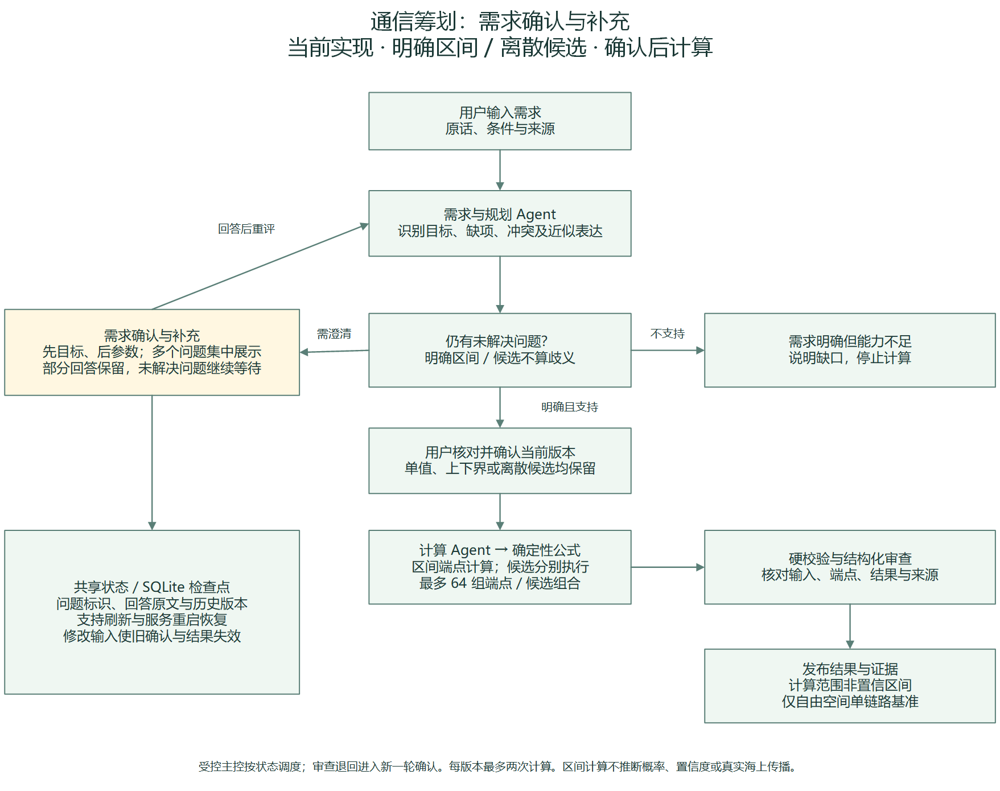
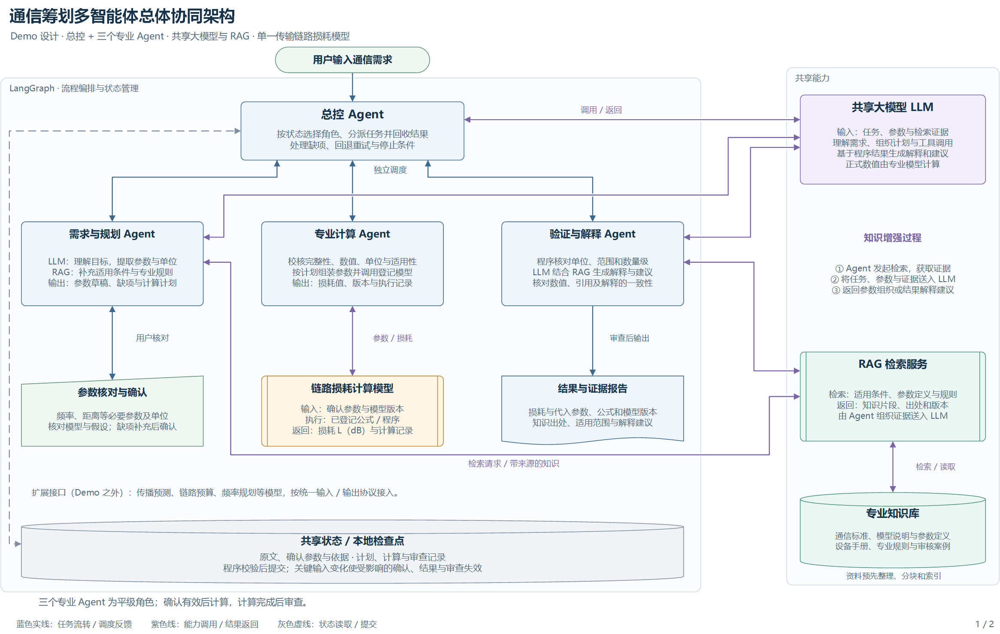
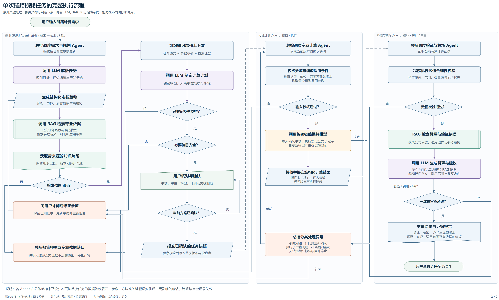

# CommPlan-Agent

**A Multi-Agent Collaborative System for Communication Planning**

面向通信筹划的多 Agent 协作研究原型。当前已接通需求解析、参数确认、计算调用建议、确定性公式计算、结构化审查与受控调度，并提供可恢复的网页工作台。

**当前版本（2026-09-21）仅支持明确声明自由空间假设后的单链路路径损耗。** 海面/散射传播、多模型计划、完整链路预算与候选优化尚未实现。

## 需求确认与补充、区间计算

模糊目标、缺失参数、冲突与近似值在页面顶部的“需求确认与补充”集中展示，并显示剩余项目数。可一次回答多个问题，也可只提交已确定的部分；已答内容、原话和未解决问题会保存，刷新或重启后可以继续。目标不明确时先澄清目标，再判断模型支持与参数要求。

- `2±0.1 GHz`、`2+-0.1 GHz` 或 `1.9–2.1 GHz`：保留上下界，确认后输出损耗范围。
- `2 GHz 或 3 GHz`：分别计算两个候选，不合并为连续区间。
- “大约 2 GHz”：要求明确范围，或由用户明确采用单值，不自行补误差。
- 2±0.1 GHz、1 km 的自由空间损耗约为 **97.975072–98.844386 dB**；这是输入范围对应的计算范围，不是置信区间。

当前扩展限定为频率和距离；每个离散参数最多 8 个候选、一次计算最多 64 组端点/候选组合。区间按上下界的组合计算，不推断相关性或概率。复杂开放语义可通过编辑任务澄清，尚未实现任意领域的自主需求访谈。



[下载当前流程 Visio 源文件](docs/diagrams/visio-demo/clarification-workflow.vsdx) · [本次交接与验证](docs/codex/CLARIFICATION_HANDOFF_20260921.md)

## 架构与流程（Visio）

下图来自项目现有 Visio 双页设计稿，展示目标协作关系。**它是设计图，不是所有连线均已实现的证明。** 当前主控使用程序策略，不调用 LLM；当前审查基于已有事实进行结构化判断，尚未实现图中的独立审查阶段 RAG 检索和自由生成解释。当前实现范围见下方职责表。



[下载可编辑 Visio 源文件（双页）](docs/diagrams/visio-demo/commplan-demo.vsdx) · [打开完整执行流程图](docs/diagrams/visio-demo/workflow.png) · [图稿来源与实现差异](docs/diagrams/visio-demo/README.md)

<details>
<summary>展开单次任务执行流程（目标设计）</summary>



</details>

## 演示视频

**待录制。** 建议用 2–3 分钟展示“一键启动 → 需求与补参 → 参数确认 → 计算与审查 → 修改后结果失效 → 历史与导出”。录制完成后在这里添加播放链接和封面；目前没有发布视频。

[查看录制步骤与发布位置](docs/demo/RECORDING.md)

## 当前工作流

需求输入 → 目标澄清 / 多项补充 → 形成单值、区间或候选参数 → 核对参数和来源 → 用户确认当前版本 → 计算 Agent 建议调用 → 确定性工具计算 → 硬校验与审查 → 受控主控决定发布、退回、重算或停止。

| 部分 | 已实现的职责 |
| --- | --- |
| 需求 Agent | 提取参数、单位、适用条件与来源，识别缺项和冲突；支持确定性解析或本机 Qwen。 |
| 计算 Agent | 读取确认快照，建议许可的工具、步骤及版本引用；参数和专业数值由程序约束，模型不直接生成计算结果。 |
| 审查 Agent | 先进行 8 项硬检查，再基于已有事实给出通过、补参、不适用或重算建议；不能绕过硬校验。 |
| 受控主控 | 使用程序策略 `bounded_policy` 调度，每版本最多计算两次；支持有限暂时故障重试与审查重算。尚不是自主 LLM 任务拆解。 |
| 网页工作台 | 总体架构单视图、节点详情、参数来源、执行时间线、角色模式、审查结果和调度记录。 |
| 状态与恢复 | 持续补参、编辑后旧确认与结果失效、SQLite 任务与 checkpoint 恢复、幂等处理、只读历史与 JSON 导出。 |

选择“本机 Qwen”时，需求、计算建议与审查分别调用本地模型。服务不可用或输出不符合结构/引用约束时，系统明确标记确定性降级。审查降级表示程序检查通过，不表示完成了模型语义审查。

页面单独显示本机 Qwen 服务的最近检查结果，可点击“检查模型服务”刷新。服务就绪与任务调用结果分别展示：模型在后台运行时也可能返回未通过校验的建议；此时图中显示“调用已降级”，详情分别列出需求、计算建议和审查的结果。重复诊断合并显示次数，逐次记录仍可展开查看。健康检查不发起推理，也不修改任务。

专业数值始终由确定性公式工具产生。当前规划流程使用词项检索；不能将旧版公式 RAG 的检索能力或公式数量视为当前多 Agent 流程已支持的模型范围。

## 启动工作台

当前入口面向 Windows、本机单用户使用。仓库不包含 Python 虚拟环境、模型权重、模型运行时二进制或本地任务数据库。

### 1. 准备本地环境

使用 Python 3.12，在仓库根目录准备 `.venv`。依赖版本见 [requirements.lock.txt](requirements.lock.txt)，环境复用与迁移要求见 [依赖决策](docs/codex/DEPENDENCY_DECISION.md)。

现有开发环境复用了本机 ML 库和模型资产；相关文档中的机器路径是开发环境记录。新机器需要重建环境并配置本地资源，不能仅复制目录就直接运行。需要本地模型时，还应按 [runtime_config.json](runtime_config.json) 配置模型与运行时路径；启动器不会自动下载模型。

### 2. 一键启动（推荐）

环境准备完成后，双击仓库根目录的 **[启动.cmd](启动.cmd)**。启动器会寻找本地模型资源、启动或复用 Qwen 服务、等待工作台就绪，并打开 **http://127.0.0.1:18082**。

模型资源查找顺序：显式 `--asset-root` / 环境变量 `COMMPLAN_ASSET_ROOT` → 当前仓库 → 同级或父级项目中的 `signal-formula-rag` 目录。本项目现有 `.workareas` 布局可自动复用旧目录中的权重和运行时，不要求再复制一份。显式指定路径时，只使用指定目录。

模型缺失、启动失败或端口无法确认时会显示原因，工作台仍可使用确定性模式；不会自动下载模型，也不会关闭已存在的服务。页面默认采用确定性模式，模型就绪后手动选择“本机 Qwen”。关闭启动窗口不会停止后台服务；新启动进程的日志与 PID 保存在 `runtime/commplan-*`。重复启动会复用已就绪的工作台及其数据库。

可选命令：

```powershell
# 只打开工作台，不启动模型
.\启动.cmd --without-model

# 指定含 runtime_config.json 的模型资源目录
.\启动.cmd --asset-root "D:\CommPlanResources"

# 新启动模型时使用 CPU（不会切换已经运行的模型）
.\启动.cmd --cpu
```

这是本地启动入口，不是包含 Python 与模型的安装包；当前提供 CMD，无需额外打包 EXE。

### 3. 单独启动网页

在仓库根目录运行：

```powershell
.\planning\run_planning.cmd
```

也可以直接使用 Python：

```powershell
.\.venv\Scripts\python.exe -B -X utf8 -m planning.web_server
```

浏览器打开 **http://127.0.0.1:18082**。默认采用确定性解析，无需启动模型。

任务默认保存在 `outputs/planning.sqlite`。如需独立数据库或其他端口：

```powershell
.\planning\run_planning.cmd --port 18083 --db outputs/demo.sqlite
```

不要重复启动占用同一端口的服务。更多操作、CLI 示例与状态说明见 [工作台使用说明](planning/README.md)。

### 4. 单独启动本机 Qwen（可选）

工作台连接本机 `127.0.0.1:18081` 模型服务。一键启动已包含此步骤。若单独使用旧版启动器，应先切换到实际含模型、运行时与环境的资源目录，再执行：

```powershell
.\.venv\Scripts\python.exe -B -X utf8 launch.py --model-only
```

然后在工作台选择“本机 Qwen”。工作台本身不会自动启动或关闭模型服务。

## 一个完整示例

输入：

> 按自由空间基准计算，频率 2 GHz，距离 1 km，求路径损耗。

解析后核对参数、来源与自由空间假设，确认当前版本并计算，结果约为 **98.420600 dB**。

如果距离缺失，系统等待补参；如果随后把频率改为 3 GHz，旧确认与旧结果失效，重新确认后结果约为 **101.942425 dB**。历史版本保留用于查看，不作为当前版本的计算依据。

自由空间基准不能证明真实海面、散射、多径环境的传播损耗，也不能单独证明链路可用。

## 已有验证与边界

需求澄清与区间扩展：198 项 Python 全量测试通过；10 项 Node 测试通过，真实 Qwen 三个角色完成区间任务，内置浏览器完成部分回答、刷新恢复与区间结果验收。详见上述增量交接。

以下来自 2026-09-21 的角色实现验收记录，不代表每次文档更新都重新执行了全量测试：

| 验证类型 | 已记录结果 |
| --- | --- |
| 自动测试 | 189 项 Python 测试、8 项 Node 测试通过；pip check 无依赖冲突。 |
| 角色验收矩阵 | 12 个案例通过；工具故障和指定审查决策使用显式模拟。 |
| 真实本地模型 | Qwen 的需求、计算建议和审查调用均完成，得到 2 GHz / 1 km 的基准结果。 |
| 真实离线降级 | 模型服务停止后，确定性降级完成计算并明确标记运行状态。 |
| 网页验收 | 已完成 Codex 内置浏览器闭环验收；目标 Chrome 验收仍待补。 |
| 独立代码审查 | 尚未完成；产品内的审查 Agent 不等同于独立代码审查。 |

详见 [角色增量交接](docs/codex/ROLE_EXTENSION_HANDOFF_20260921.md)、[验证汇总](docs/codex/evidence/role-extension-validation-20260921.json)、[真实模型证据](docs/codex/evidence/role-extension-live-20260921.json)与[验收矩阵](docs/codex/evidence/role-acceptance-matrix-20260921.json)。

交接与证据中的提交、发布状态是生成时的历史记录；GitHub 发布版本以仓库提交记录为准。

当前没有自主任务拆解、海面/散射计算、多模型多步骤筹划、候选优化、多用户权限或分布式执行，也没有完成单 Agent / 多 Agent 效果对照。下一步先补独立审查与目标浏览器验收，再为下一种传播模型确定适用条件、输入输出合同及独立数值基准。工程进度入口见 [NEXT_ACTION.md](docs/codex/NEXT_ACTION.md)。

## 保留的公式 RAG 基线

仓库同时保留旧版通信公式本地 RAG，包含 7 张基线公式卡、公式检索、参数抽取、确定性求值及公式导入流程。旧应用通过 `launch.py` 启动，网页端口为 `18080`；当前通信筹划工作台的入口为 `planning/run_planning.cmd`，端口为 `18082`。

公式表达式由受限求值器执行。导入公式的草稿状态与审核状态分开管理；未经确认的公式不能直接作为正式数值依据。原始公式资料用于开发整理，不作为网页运行时必需输入，也不包含在本仓库的模型资源分发中。

## 目录导航

| 路径 | 内容 |
| --- | --- |
| [planning/](planning/) | 工作台、Agent 角色、LangGraph 工作流与任务服务 |
| [formula_rag/](formula_rag/) | 复用的公式检索与确定性计算能力 |
| [tests/](tests/) | 回归测试 |
| [scripts/validate_role_slice.py](scripts/validate_role_slice.py) | 受控角色验收矩阵 |
| [docs/codex/](docs/codex/) | 工程合同、阶段交接与验收证据 |
| [启动.cmd](启动.cmd)、[start_commplan.py](start_commplan.py) | 一键启动当前工作台与本地 Qwen |
| [launch.py](launch.py) | 旧公式 RAG 与本地模型服务启动器 |

## 许可与本地资源

项目代码使用 [MIT License](LICENSE)。本地模型、嵌入模型和推理运行时分别遵循各自许可证，使用或分发前请查看对应资源的许可说明。模型权重、运行时与虚拟环境不随本仓库分发。
