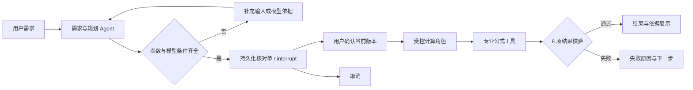

# 确认计算闭环交接

日期：2026-09-18。工作区：`E:/codex/项目/信号与AI/.workareas/signal-formula-rag-h0-implementation`。profile：`confirmed-fspl-loop-v1`。本文件描述当前增量；首个 Agent 的设计与 CLI 历史见 SINGLE_AGENT_HANDOFF.md。

## 可用结果

启动 `planning/run_planning.cmd`，在 Chrome 打开 <http://127.0.0.1:18082>。网页中完整示例可完成解析、核对、确认、计算、校验；默认无需模型。需求 Agent 可选本地 Qwen，计算角色是确定性受控工具调度，不是第二个 LLM 推理 Agent。

登记模型 `fspl_ghz` v1.0.0：`92.4 + 20*log10(frequency_ghz) + 20*log10(distance_km)`。2 GHz、1 km 为 98.42059991327963 dB；3 GHz、1 km 为 101.94242509439326 dB。独立数量级检查用光速及 4π，容差 0.05 dB，以容纳模型卡舍入常数约 0.048 dB 的差异；发布值始终来自登记公式。

## 数据与接口

- `planning/workflow/task_service.py` 是唯一命令边界。create/edit/confirm/cancel 都要求 task_id、event_id、expected_revision、expected_state_version；确认还要求服务器返回的 review_hash。
- create/edit 的 input 包含 raw_text、manual_parameters、condition、target；mode 为 deterministic 或 llm。不能通过确认请求注入快照、计划或结果。
- `task_store.py` 在 `outputs/planning.sqlite` 中同事务提交任务、事件、历史与官方 SQLite checkpoint。schema setup 在事务前；业务使用 BEGIN IMMEDIATE。当前为本地串行模型。
- edit 增加输入版本并清空确认快照及结果；thread_id 随 task/revision 变化。幂等事件查找先于版本检查；相同事件返回原回执和当前状态，不把旧状态写回。
- `planning_graph.py` 实现需求 → human_confirmation interrupt → calculation → validate_result → publish。确认节点中断前不写外部副作用；恢复由可信服务生成快照。取消不依赖模型目录可用。
- `confirmation.py` 的核对内容含完整选中模型卡及 hash。确认时检查当前登记内容，目录变化拒绝旧确认。
- `services/calculation.py` 检查快照、输入、计划、依据、模型/公式、数值/名称/单位和独立数量级；失败不发布正式结果。final_report 自含输入来源、公式、版本、结果、校验和限制。

HTTP：GET `/api/session` 获取本次服务 token；GET `/api/tasks/<id>` 和 `/api/tasks/<id>/history` 读状态；POST `/api/commands` 提交命令，要求 `X-Planning-Token`。仅绑定 127.0.0.1，校验 Host/Origin，拒绝重复 JSON 字段、非有限值、非法 UTF-8 和大于 65536 字节请求。静态资源白名单和 CSP 限制脚本来源。重启后网页刷新取得新 token。这是本地访问防护，不是多用户身份权限系统。

## 验收与修复

`evidence/planning-loop-tests.log`：164 项 Python 全量通过（50.050 秒）。其后仅修改来源 Unicode 切片及静态模块接入，定向 4 项 HTTP 和 1 项 Node 测试通过。新增 17 项闭环与 4 项 HTTP 测试覆盖确认前零计算、缺参/冲突/不支持、编辑失效、幂等、双客户端竞争、注入、子进程恢复、异常/强退回滚、目录变化、非有限结果与取消。

可见 Chrome 验证：2 GHz 计算、刷新恢复；编辑 3 GHz 使旧结果失效；未保存修改禁用确认；服务重启后恢复并计算；缺距离、手工补值、冲突阻断、取消；emoji 来源修复与最终成功计算。未声称做过移动端或全面响应式验收。

真实 Qwen 记录在 `evidence/planning-loop-live.json`；模型停止后的离线降级完整闭环在 `evidence/planning-loop-offline.json`。检索均为 lexical_fallback，不声称 dense RAG。来源状态继承库内登记，本轮未独立重审原始文献。

独立审查发现并关闭：最终报告上下文不足；取消依赖目录读取；emoji 导致来源文字索引错位。另补充结果模型/公式/名称一致性与数量级防篡改测试。见 `evidence/planning_loop_review.json`。

## 运行与恢复

双击启动器运行前台服务，Ctrl+C 停止。当前演示保留了隐藏的本地网页服务，启动记录在 `runtime/planning-web.pid`，日志在同名前缀的 `.out.log/.err.log`；若需要停止，先核对 PID 及命令确为当前工作区的 `planning.web_server`，同时核对子进程，不要按 Python 进程名批量停止。不要同时启动第二个 18082 服务。

任务 ID 和数据库都保留时可跨浏览器刷新、服务重启恢复；清空浏览器存储后仍可手工输入 ID。数据库位置可用 `--db` 指定。备份数据库应在服务停止后进行。当前环境复用源仓库 ML 资产，跨机不能只复制 planning 目录；依赖说明见 DEPENDENCY_DECISION.md。

验收启动的本地 Qwen 已核对进程身份后关闭；网页默认模式可继续使用。模型入口不自动启动模型，也不下载权重。需要 Qwen 时按 planning/README.md 的原有启动方式操作。

## 范围边界

只支持声明假设下的自由空间单程路径损耗；不证明现场远场条件，不覆盖真实海面反射、散射、遮挡或链路预算。整体流程图中已有可运行的需求—确认—受控计算—校验链，但没有修改原始 VSDX，也没有实现其余业务 Agent、完整 GraphState 合同、分布式执行和多用户权限。没有提交或推送 Git；原应用与知识目录未改。
