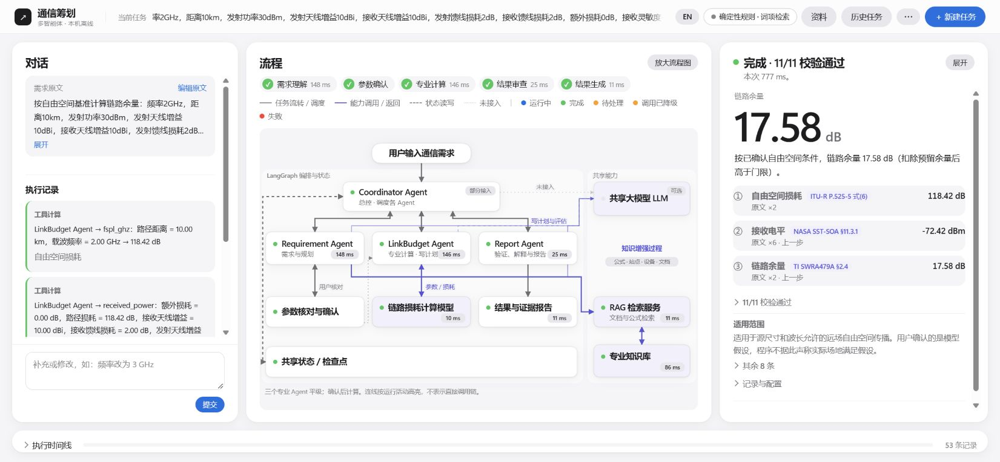
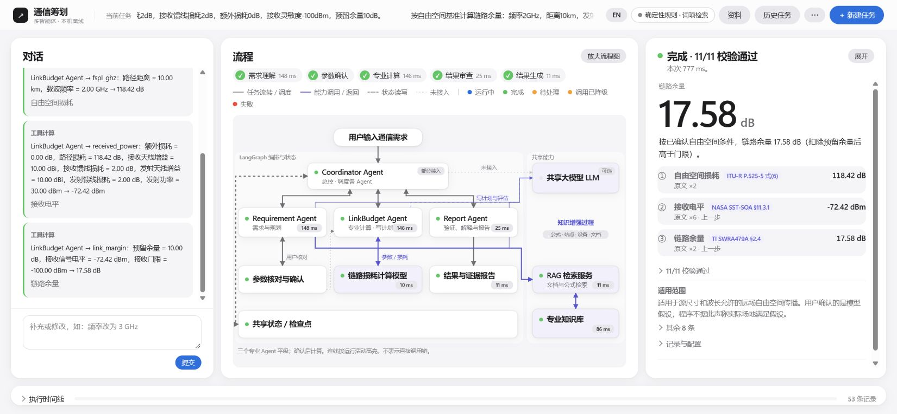
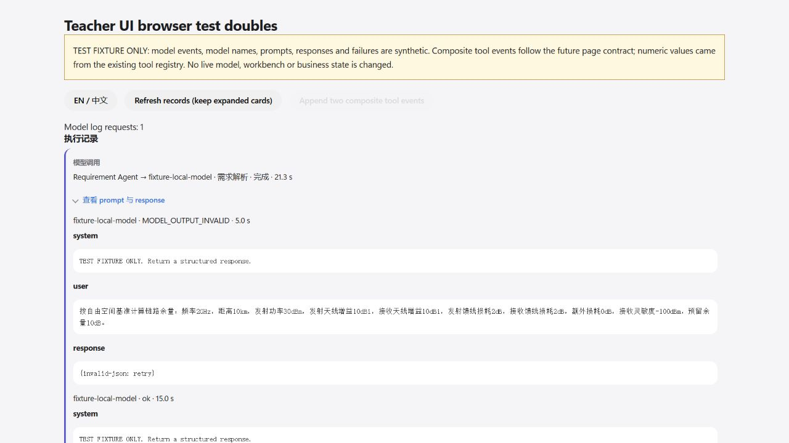
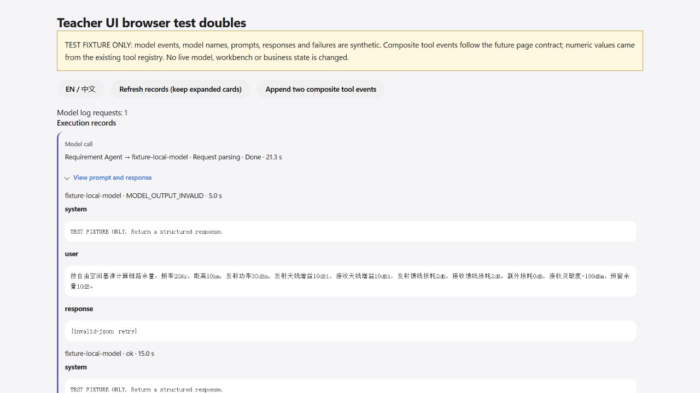

# T3：执行记录验收（2026-10-01）

基线 `0fe5742`，分支 `codex/m1-teacher-ui`。T1/T2 已由 Claude 合入 `d722076`，静态资源映射在 `0fe5742` 提供。按任务单先完成 T3，再开始 T4；本证据随 T3 提交，实际提交号记录在 NEXT_ACTION 顶部。

## 实现与范围

- 新模块 `planning/web/records.mjs`：纯 `records(state, events)`、模型日志时间窗匹配及安全 DOM 渲染。仅使用当前 task/revision，模型 started 与结束事件合并；失败事件缺省 attempt 时仍能结束对应调用。保留运行中、失败原因、单步和每调制复合工具调用。
- 旧版本没有事件时，从 `result.steps` / `final_report.tool_calls` 恢复工具卡，并显示“历史版本只显示工具计算”。
- 稳定容器与卡片 key 保留已展开 details；日志首次展开请求，稳定轮询使用缓存，模型完成后刷新缓存。系统/用户消息和 JSON response 使用 textContent 与 `translate="no"`，内容限高滚动。
- app.js 只新增 import 和渲染接线；index 增加对话记录之后的容器；CSS 和英文词典补齐卡片显示。
- `details.mjs`、`m1.mjs`、`questions.mjs` 和所有 Python 文件未修改。没有 push、merge、PR；既有工作台和模型服务未停止、切换或重启。

## 数据与 Node 验证

新增 `tests/planning_records.test.mjs` 共 17 项，覆盖合同要求、日志重试/排除窗口、安全原文、轮询展开和缓存、失败重试、实际完整模型/工具概要的英文翻译。

- `tests/fixtures/teacher_ui/margin-completed.json` 为现有 TaskService 在临时 SQLite 中以确定性模式执行 `tests/test_calculation_plans.py:MARGIN` 的 create/confirm 实际完整状态与活动，包含可追溯输入和命令。
- `records-model.json` 明确标注测试替身：3 个模型卡（完成、失败、运行中），2 次需求重试及错误 task/revision/时间窗的排除对照。3 个 `calc_link_margin` 事件按约定制造，数值来自已登记确定性工具；未调用真实模型。
- `tests/teacher_ui_preview.mjs` 是只使用 Node 内置模块、GET 与显式资源白名单的本地浏览器夹具页面。便于复验模型日志和未来复合事件，不增加业务服务接口。

## 浏览器验收

本次 Chrome 未连接，使用 Codex 内置浏览器。工作台是独立测试端口 `60431`，SQLite 位于 TEMP；测试替身页面是独立端口 `53927`。

1. 在 API 明确指定 deterministic 创建 MARGIN，浏览器恢复 `teacher-ui-browser-t3`，核对三步计划并勾选确认执行；结果完成且 11/11 校验通过。
2. 执行记录中恰有 3 张工具卡：`fspl_ghz` 118.42 dB、`received_power` −72.42 dBm、`link_margin` 17.58 dB。最后一步显式显示灵敏度 −100 dBm、预留余量 10 dB。
3. 替身页面首次展开 Requirement 模型卡，显示两次调用的 system、user、response；JSON response 缩进，原始内容不翻译。日志请求数由 0 到 1。
4. 刷新与追加其余两张复合工具卡后，原 details 仍展开，工具卡由 1 到 3，日志请求仍为 1。
5. 英文模型用途、状态、参数概要、复合工具名称与结果标签全部译出；原始中文 user prompt 与 response 保留。页面控制台没有 error/warn。

截图：

## 全量回归

命令：主工作区 Python `-B -X utf8 -m unittest discover -s tests -p test_*.py`；Node `node --test tests/planning_*.test.mjs`。原始输出分别为 `2026-10-01-T3-python.log`、`2026-10-01-T3-node.log`。

Python：495 项通过（1 skip），0 失败，369.947 s。Node：87 项全部通过，0 失败。日志里启动/关闭服务的输出来自既有 launcher 单元测试的替身，不是本次操作在运行的模型或工作台。

## 偏离与限制

没有改变业务或数据合同。尚未由后端提供的复合工具事件使用任务单格式的测试替身；模型卡验收也是替身，不声称真实模型调用通过。浏览器证据来自内置浏览器。最终结果与当前模型能力的区别保留。
