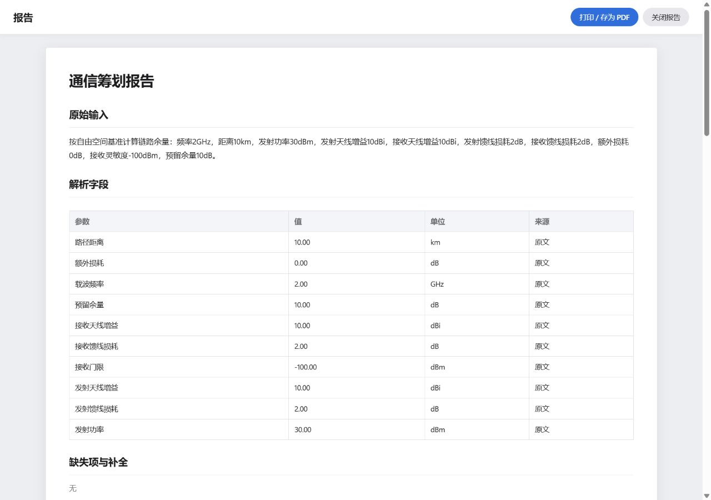
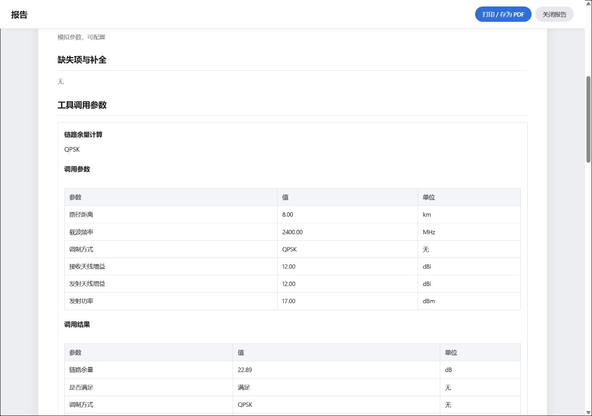
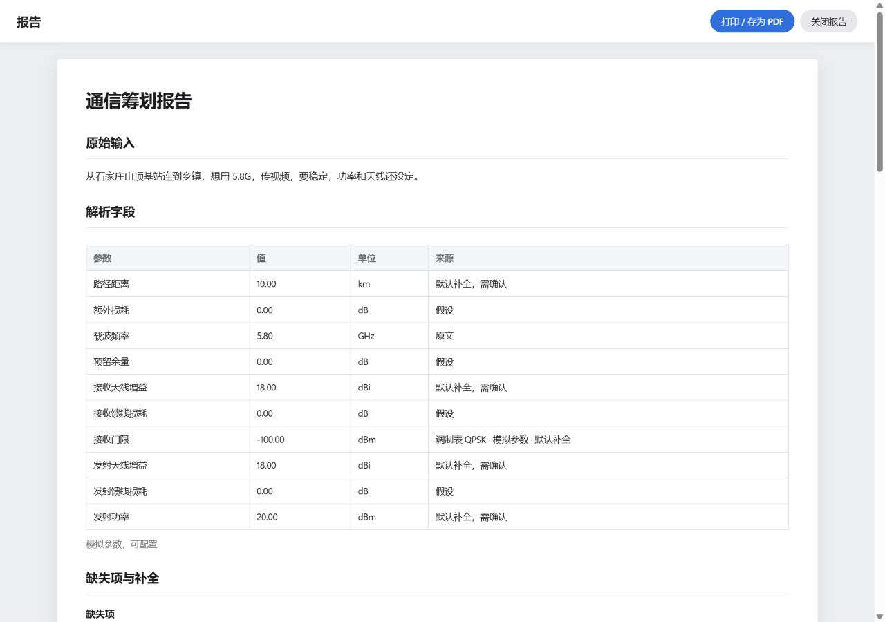
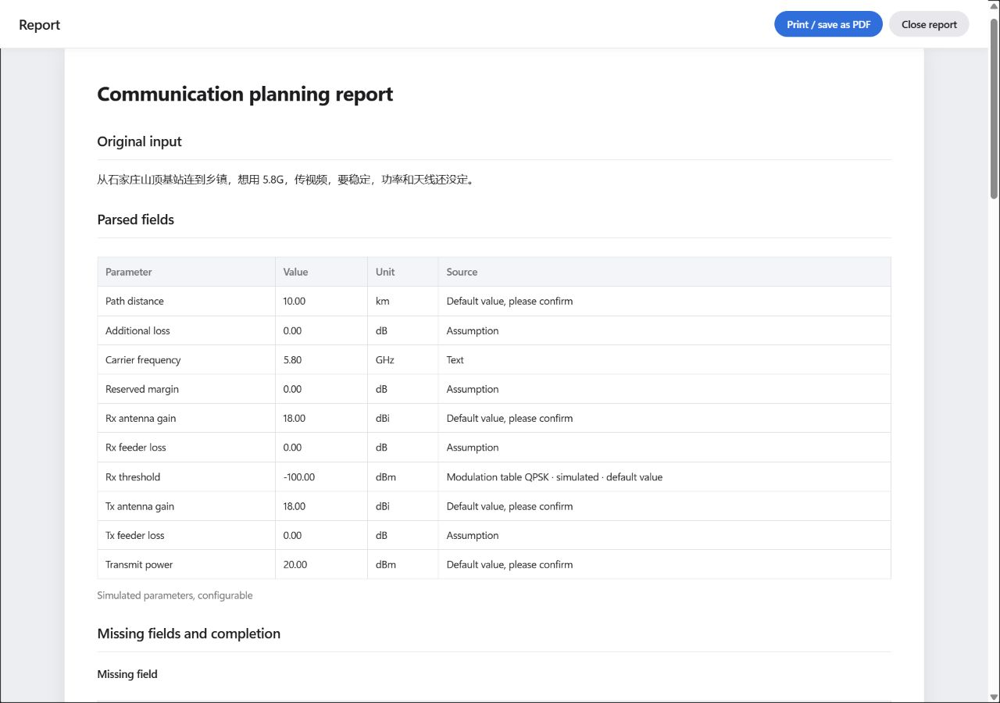
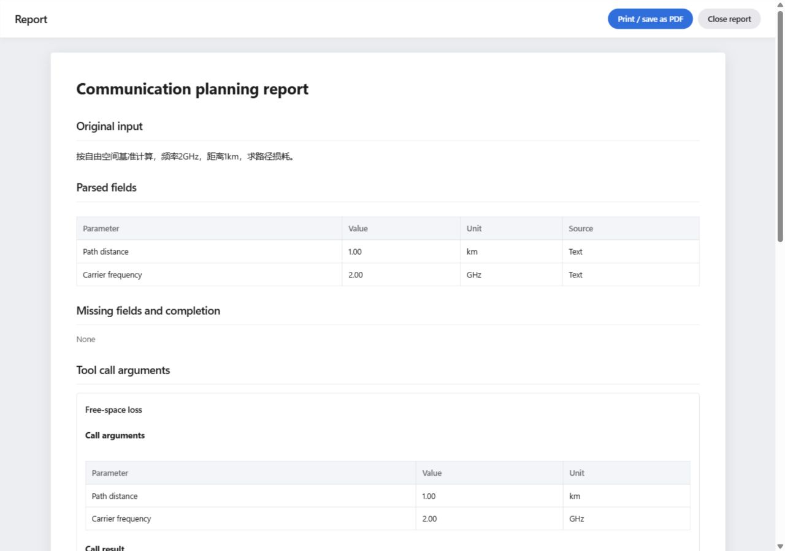

# T4：报告视图验收（2026-10-02）

工作区 `CommPlan-Agent-M1-codex`，分支 `codex/m1-teacher-ui`。任务范围按 `git show claude/calc-plans:docs/codex/TEACHER_TASKS.md` 的 T4；交付提交号在 `NEXT_ACTION.md` 顶部。

## 前置提交与范围

- 开始时仅有 T3 状态行未提交；核对该行后单独提交 `51de6b4`。
- 随后执行 `git merge claude/calc-plans`（`2985b0a`），无冲突，生成合并提交 `e5b77ca`。本次 T4 变更均相对该合并基线验收。
- 新增 `planning/web/report.mjs`，纯 `reportModel(state, events?, context?)` 投影与安全 DOM 报告面板；不修改保存的状态或事件，不另行调用模型和计算工具。
- `app.js` 只有一个 import 和一条 render 接线；`index.html` 放置稳定的结果区入口与 body 直属报告面板。`app.css` 追加报告和打印规则。
- `originLabel`、`comparisonPresentation` 从 `m1.mjs` 复用。报告对比表在共享展示数据上补 FSPL 列。`details.mjs`、`m1.mjs`、`questions.mjs` 与所有 Python 业务文件相对基线没有修改。
- `i18n-en.mjs` 在 `TEACHER_PATTERNS` 后新增 `REPORT`、`REPORT_PATTERNS`；`EXACT`、`PATTERNS` 只在末尾追加对应展开项，其他块未改。
- 没有推送、合并到其他分支或开 PR。

## 报告内容

报告的八节为：原始输入、解析字段、缺失项与补全、工具调用参数、计算结果、对比表、模型解释、附注。

原始输入优先保留 `conversation.original_input.raw_text`，缺失或空串时使用 `request.raw_text`。参数来源读取当前需求文本，以正确识别 span 后的默认补全标记；手填、站点库、设备库、假设、调制表等来源沿用原页面的标签逻辑。默认补全参数显示“默认补全，需确认”；调制模拟数据保留“模拟参数，可配置”。

有 `final_report.tool_calls` 时列出每次复合调用；否则列 `result.steps`，原生单步旧形状则使用 `normalized_inputs` 和 `outputs`。MARGIN 灵敏度读取 link_margin 步骤输入，余量使用已保存的数值（已经扣除 reserve，不再次扣除）；是否满足按要求余量比较，缺少余量结果时显示“无”。

缺失项只取 resolved issues 中 `kind=missing` 的项；建议补全回答来自 `mode=suggestion` 的 answer 轮。系统字段题名随英文界面翻译，原始输入、补全回答、模型回答、逐步说明与审查原话使用 `textContent`、`translate=no`，不会被解析为 HTML 或翻译。缺数据、空模型回答和旧状态显示“无”。

完成时间使用保存的 `generated_at` / `finished_at`，不会用当前时间冒充完成时间。模型名来自当前任务与 revision 的活动或组件模式；公式 `model_id` 不被当作语言模型名。调用次数按当前 revision 的活动事件统计：llm started、tool completed；模型重试若只在 HTTP 日志中记录，则不额外计数，页面明确说明。没有活动历史时工具数来自保存的调用记录；确定性状态模型数为 0，不能确认的模型数显示“无”。

## 四份真实确定性夹具

`tests/generate_teacher_report_fixtures.py` 在临时 SQLite 中通过 TaskService 的 create / answer / confirm 运行，要求 COMPLETED、全部结果校验通过、模型调用日志为空、无 llm 事件。完整状态、活动、原始命令与来源记录在 `tests/fixtures/teacher_report/`，未改写实际 UUID、哈希或时间。捕获基线为 `e5b77ca`。

| 夹具 | 来源与流程 | 结果 | 工具完成事件 |
| --- | --- | --- | --- |
| margin.json | `tests/test_calculation_plans.py:MARGIN`；create → confirm | FSPL 118.4205999133 dB；Prx −72.4205999133 dBm；灵敏度 −100 dBm；余量 17.5794000867 dB | 3 |
| comparison.json | teacher_03，参照 `TEXT3` 显式写“天线增益 12dBi”；manual target=link_margin；create → confirm | FSPL 118.1060245741 dB；Prx −77.1060245741 dBm；QPSK 22.8939754259 dB，16QAM 17.8939754259 dB；差 5 dB，推荐 QPSK | 5 |
| defaults.json | teacher_02，按任务单指定测试采用所有 suggestion 后 confirm | 距离 10 km，功率 20 dBm，收发增益各 18 dBi，QPSK；余量 28.2914401287 dB | 4 |
| fspl_legacy.json | 2 GHz、1 km 的确定性单步 FSPL；create → confirm | 98.4205999133 dB；原生 result 无 steps | 1 |

四份均无真实语言模型调用。FSPL 虽允许手造，本次也使用真实完成状态。

defaults 的 resolved issues 共五项，其中四项为 missing，调制为 choice；suggestion 回答轮完整包含五项，不能按 missing 数量遗漏调制回答。comparison 的工具事件为三个基础卡步骤加两次复合调用；报告正文列出两次 `calc_link_margin`，附注的“工具计算次数”为五条活动事件，两种口径保留并说明。

## 自动测试与独立审查

新增 `tests/planning_report.test.mjs` 共 20 项，覆盖真实数据投影、MARGIN 独立式复算、参数来源标签复用、建议补全、对比表六列与推荐、FSPL 原生旧形状、缺数据/空串、要求余量判断、原话/XSS 保护、当前任务与版本计数、无事件回退、完成任务入口、打开/关闭/焦点与打印调用、轮询与任务切换、英文完整翻译。

独立子代理只读审核模块、接线、夹具、打印规则和范围，发现系统题名错误标 `translate=no` 后已修正并加专项测试；最终复跑 20/20 通过，无未处理阻塞项。另确认桌面已有 `html,body` 的 overflow/height 规则必须在报告打印时重置，已按报告打开状态限定覆盖。

- 全量 Node：`node --test tests/planning_*.test.mjs`，109 项通过，0 失败。原始日志 `2026-10-02-T4-node.log`。
- 全量 Python：主工作区 Python `-B -X utf8 -m unittest discover -s tests -p test_*.py`，共 505 项（1 skip），0 失败，313.955 s，进程退出码 0。日志 `2026-10-02-T4-python.log`；其中部分中文由隐藏 PowerShell 的原生输出解码产生乱码，未改写原始日志，英文完成摘要和退出标记完整。
- `git diff --check` 与模块语法检查通过；禁止修改文件相对 `e5b77ca` 的 diff 为空。

## 浏览器验收

Chrome 未连接，使用 Codex 内置浏览器。`tests/teacher_report_preview.py` 在临时 SQLite 重放四份真实命令，通过现有生产 UI/API 另起随机端口。最终验收端口为 `51425`。桌面视口 1280 × 900 验证报告占满视口宽度；默认窄视口也可打开并滚动，表格可横向滚动。

1. MARGIN 恢复完成任务，结果区入口打开报告，核对全部八节、三次工具步骤、FSPL/Prx/灵敏度/余量和计数 0/3。
2. teacher_03 核对两次复合调用、两行对比的灵敏度、FSPL、Prx、余量、满足判定；5.00 dB 差值与 QPSK 推荐正确，附注工具事件数为 5。
3. teacher_02 原始输入保留未补全的原话；解析字段显示默认补全/调制模拟标签；缺失表四项，建议回答表五项完整。
4. 英文界面八节、字段和系统题名全部译出；原始中文需求及五个补全回答不变。DOM 中可翻译叶文本无残留中文，见 `2026-10-02-T4-english-dom.json`。
5. 单步 FSPL 报告显示 98.42 dB，其余未计算的结果为 None；不会伪造灵敏度、余量或满足结论。
6. 关闭面板后焦点返回报告按钮、清除打印标记；新建任务后入口与面板均隐藏。浏览器控制台 error/warn 为空。
7. 按任务单允许的“window.print 前的 DOM 检查”验收打印隔离：报告打开时 body 直属 header、main、toast 和其他 sheet 全匹配 `display:none!important` 排除选择器；报告恢复静态布局、toolbar 隐藏。命名页 `commplan-report` 为 A4 纵向、14 mm 页边距；表格行 `break-inside:avoid`，thead 重复；报告、html/body 与长文本取消屏幕高度/overflow 限制。关闭报告后不启用该打印隔离。完整 CSSOM 和匹配项见 `2026-10-02-T4-print-dom.json`。`window.print()` 调用由 Node 控制器测试验证；未调用系统打印机、未导出实物 PDF。

截图：

## 执行会话中断与服务观察

开始时 18081/18082 的监听进程分别为 30816/25780。本轮没有对这两个服务执行停止、重启或切换操作。

中途原 exec 会话句柄消失、原浏览器标签消失，首轮 Python 日志没有完成摘要，隔离端口 56776 也失去监听。重新取得执行连接后，18081/18082 未观察到监听；具体外部原因没有核定，不能声称它们一直运行。未擅自恢复这两个服务。首轮日志保留为 `2026-10-02-T4-python-interrupted.log`，不计为通过。

之后在隐藏的独立进程中重新执行全量 Python，并仅恢复本轮的临时验收服务到新随机端口 51425。浏览器证据取自这一轮最终验收。launcher 单元测试输出的“启动/停止”文字来自其测试环境，不是本轮对用户运行服务的操作。
