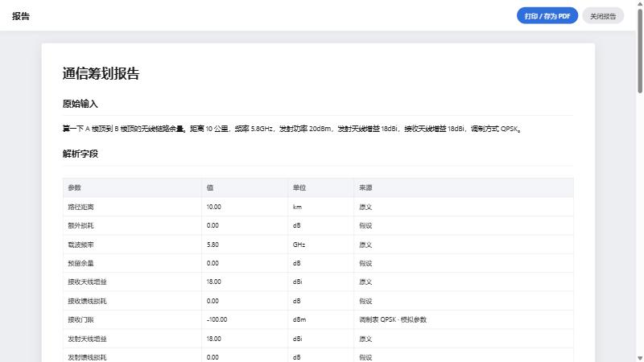
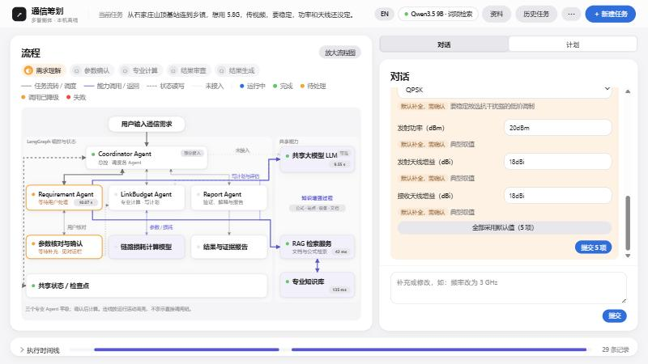
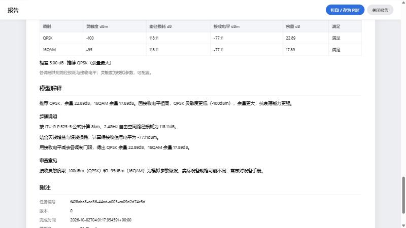

# 浏览器与断网验收：老师三条案例（2026-10-02）

分支 `claude/calc-plans`，验收时 HEAD 为 `cb2dd89`（已含 T4 报告视图）。工作台在 18082，本机 Qwen3.5 9B Q4_K_M 在 18081，向量模型在 18084，三者都只监听 127.0.0.1。页面设置为“本机 Qwen”。

## 三条案例（在工作台页面里手动输入原文）

| 案例 | 任务 | 过程 | 结果 |
| --- | --- | --- | --- |
| 一 | `3d7e4f96` | 提交 → 待确认 → 确认 | FSPL 127.71 dB，Prx −71.71 dBm，灵敏度 −100 dBm（调制表 QPSK · 模拟参数），余量 28.29 dB，满足；12/12 校验通过 |
| 二 | `7cdbfd0d` | 提交 → 5 项待处理（距离、功率、两端增益、调制），表单里预先填好 10 km、20 dBm、18 dBi、18 dBi、QPSK，都标“默认补全，需确认” → “全部采用默认值” → 确认 | 数值同案例一；审查指出山区遮挡没有计入、馈线损耗按 0 计，需要核对；12/12 |
| 三 | `f428aba8` | 提交 → 待确认 → 确认 | 对比表：QPSK 22.89 dB、16QAM 17.89 dB，相差 5.00 dB，推荐 QPSK；解释为两者接收电平相同，QPSK 的门限更低，所以余量更大；12/12 |

三份报告都有八节：原始输入、解析字段、缺失项与补全、工具调用参数、计算结果、对比表、模型解释、附注。附注里模型名 `qwen35-9b-q4`，模型调用 3 次，工具计算分别为 3、4、5 次。







## 断网等价核查

没有改系统的网络设置。改为核查运行时有没有出本机的流量：

1. 页面：三条案例跑完后，`performance` 记录的 251 个资源全部来自 `http://127.0.0.1:18082`。页面只引用 `app.css`、`lang.js`、`app.js`，不用外部字体，也不走 CDN。
2. 服务进程：跑案例的 8 分钟里，每隔几秒记录一次三个服务进程（llama-server ×2、工作台 python）的全部 TCP 连接和 UDP 端点，共采样 45 次（脚本 [netwatch.ps1](2026-10-02-offline-netwatch.ps1)，记录 [netwatch.csv](2026-10-02-offline-netwatch.csv)）。远端地址只有 `127.0.0.1`，另有工作台本地绑定的 `0.0.0.0`；没有外部地址。
3. 代码：运行代码与页面中非本机的网址只有两类：`knowledge/` 里公式出处的引用链接，和 SVG 的 `www.w3.org` 命名空间。两者运行时都不会访问。

采样间隔约 10 s，可能漏掉很短的连接，所以第 2 条不等于真正断网。真正断网要在开飞行模式的状态下跑一遍，这一步需要用户来做：

```
"E:/codex/项目/信号与AI/CommPlan-Agent/.venv/Scripts/python.exe" -X utf8 -B scripts/eval_teacher.py --mode llm --only teacher_01 teacher_02 teacher_03
```

## 发现的差距

案例二期望“识别站点 A、B……业务为视频”。目前站名只记作标签，在假设里写成“距离按原文；‘石家庄山顶基站’、‘乡镇’只作标签”；报告的“解析字段”里没有站点一行。业务类型（视频）没有单独记下：“传视频”“要稳定”只用来判断目标是链路余量、补全时选调制方式。
