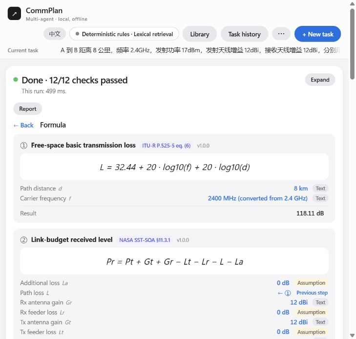

# 用户可见文案清理（2026-10-02）

用户确认范围：页面、提示、公式卡、模型说明、导出报告和使用说明清理“老师验收”、M1、周次、内部任务等过程背景。保留专业功能、适用条件、公式出处、常数约定、版本、模拟数据标记。内部设计、任务单和历史验证记录保留。

工作区：`CommPlan-Agent-M1-codex`；分支：`codex/m1-product-copy`；基线：`0f37c13`（PR #7 合并后的 main）。

## 修改

- `fspl_mhz` 标题改为“自由空间基本传输损耗”。说明、常数约定和推导去掉验收/兼容过程用语，保留 MHz/km、32.44、精确光速时的 32.4478、GHz 形式的约 0.04 dB 差异；保留 ITU 来源和内部常数约定路径，不把 32.44 声称为 ITU 式(6)的 32.4。
- 调制来源显示为“调制灵敏度表（模拟）”；实际路径、版本、灵敏度、模拟标记保持原值。补充传播公式的推导采用专业表述，核对日期仍在来源元数据中。中英文同步。
- 旧任务的已知公式/检索标题、来源、假设、限制和诊断摘要只做显示别名。数据库、原始输入、文档摘录、模型日志、证据 JSON、hash 核对保持原样。不同 hash 的当前卡继续隐藏。
- 公式卡元数据说明允许英文翻译；文档原文保持原样。参数来源名称与定位分开显示，分别翻译。
- README、使用说明和许可说明移除阶段/周次，区分当前源码与正式 v0.1.0。导入提示说明当前适用条件限制。
- 修复参数溯源页既有 `const raw` 遮蔽 `raw()` 的命名冲突，改名为 `original`，避免 ReferenceError。
- 工程约定补充产品文案规则。

## 验证

- 全量 Python：`python -B -X utf8 -m unittest discover -s tests -p 'test_*.py'`，509 项，`OK (skipped=2)`，522.535 s。
- 全量前端：`node --test tests/planning_*.test.mjs`，111 项通过、0 失败。
- HTTP 冒烟：`scripts/planning_smoke.py --root .`，PASS；创建、确认、服务重启后恢复通过。
- 元数据前后对比：除标题、说明、说明性 notes 和 derivation 外，公式、参数、单位、数值、示例、版本和来源 URL/路径等一致；调制数值、版本和实际来源路径一致。
- 真实历史夹具展示测试覆盖公式、依据、已完成主面板、待确认计划；普通文案无“老师/验收”，原始 state/card 不变，不同 hash 的当前卡继续隐藏，用户原文保留。
- i18n 测试扩大到 MHz 公式的整段说明、参数说明、条件和推导。
- 独立审查发现历史假设/诊断摘要遗漏、公式卡说明被误标为原文不可翻译两项问题；均修复复核，无剩余阻塞问题。

## 页面检查

用现有 `tests/teacher_report_preview.py` 在独立临时数据库和临时端口重放确定性计算。Chrome 未连接，检查使用 Codex 内置浏览器；不计为目标 Chrome 检查或真实模型测试。已检查中英文公式页、英文依据页、参数溯源、报告预览，模拟标记、数值和出处正常，浏览器 error 日志为空。报告检查覆盖打印前 DOM，未新导出 PDF。

## 交付状态

修改保存在本地 Codex 分支，未推送、未合入 main，未改当前 `claude/calc-plans` 工作区。复核并应用本地提交后，应重启工作台，让新元数据用于新任务；历史任务继续保留自己的计算版本与证据。
