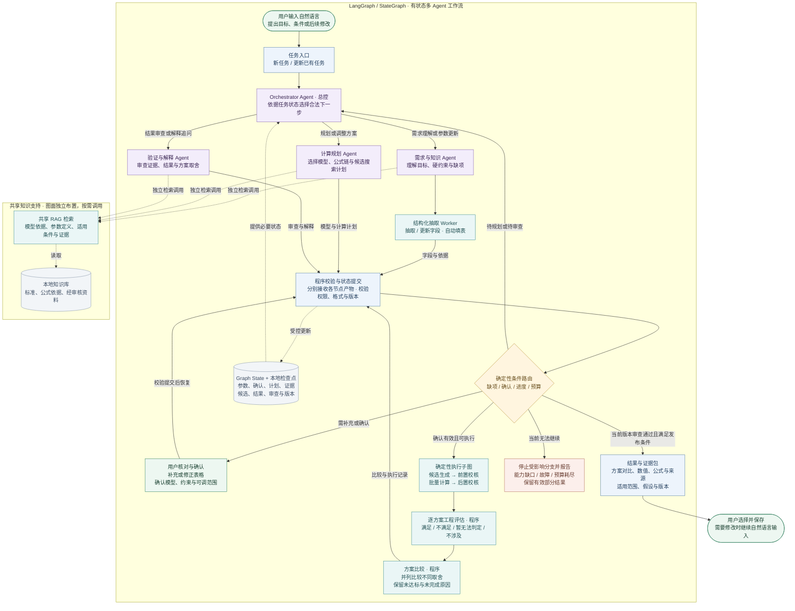

# 基于 LangGraph 的通信筹划智能体协同总体流程 · v1.4

工程引用：本图已计入[工程需求基线 R1](../../requirements.md)。后续实现按该基线和当前图推进；图稿存在不表示程序已实现。

日期：2026-09-15。性质：当前目标设计，尚未实现。包含 19 个主要节点，展示动态总控、三个专业 Agent、自动填表、确认、计算、审查与比较；三个专业 Agent 独立连线。

## 可直接查看的图

[矢量图 SVG](./通信筹划协同流程_v1.4.svg)可放大查看；[Mermaid 源码](./通信筹划协同流程_v1.4.mmd)用于继续编辑结构。SVG 固定了每条线的位置；Mermaid 阅读器可能重新布局，不保证复现相同的线条位置。

## 图面调整

- 总控分别连接三个专业 Agent，每条调度线拥有独立的起点、路线和终点。
- 需求 Agent 经抽取 Worker 提交字段；规划 Agent 提交模型与计划；验证 Agent 提交审查与解释。三条提交线独立进入程序校验节点的不同位置，不使用中途汇合的公共线。
- 三个 Agent 的检索箭头放在底部知识支持区，分别进入同一个共享 RAG。底部名称是上述 Agent 的引用标签，不是新增 Agent；也不表示三个知识库。
- 自动填表、用户确认、程序条件路由、候选批量计算、工程评估、方案比较、状态持久化、停止出口均保留。
- 细节放入节点内的短说明和本页规则，不再将大量说明塞进箭头。无圆点的线条交叉不表示汇合。

## 不可省略的逻辑

1. **条件调度**：总控的三个出口表示按状态选择角色，不表示三个 Agent 必须同时运行，也不规定每轮都走完三者。
2. **确认之后计算**：执行必须使用当前版本已确认的参数、模型与假设、硬约束、可调范围及搜索规则。缺项由用户补充；不从参考 Excel 或模型猜测中填默认值。已确认范围内的候选无需逐个确认。
3. **计算之后审查**：候选执行、评估、比较产物先校验入状态；条件路由再经总控调度验证与解释 Agent。正式比较结果必须具有当前版本有效的审查记录，不能从计算节点直接发布。阻断发现按原因进入补问、受限恢复或停止。
4. **程序负责数值与判定**：规划 Agent 选择已登记模型及组合方式；公式工具生成专业数值；工程规则产生约束判定。验证 Agent 不改写数值，不用语言模型的“通过”覆盖程序发现的问题。
5. **达标与搜索完成分开**：工具故障或条件未知不能伪装成不达标；有限预算内未找到达标方案也不等于已证明无解。没有达标方案时输出原因与搜索范围，不能展示虚构推荐。
6. **比较之后用户选择**：仅比较用户确认范围内的参数组合，达标方案并列呈现取舍，不擅自加权评分。首版不承诺设备型号推荐。
7. **更新之后版本失效**：用户修改距离、雨天条件或搜索范围后，受影响的计划、确认、结果与审查失效并重走必要步骤。解释追问可复用有效版本结果；共享 State 是数据，由程序校验提交。
8. **路由有边界**：程序检查状态、版本、合法动作和预算。可恢复错误只作有限恢复；无可用模型、关键能力缺口或预算耗尽时停止受影响分支，报告真实原因并保留有效部分结果。

图中“满足发布条件”按请求类型判断：方案比较要求候选结果、工程评估、比较和审查全部有效；纯知识或解释追问要求相应依据与审查，不强迫做无关的批量计算。条件路由和状态提交是逻辑职责，实际 LangGraph 实现可以分散在多个节点及条件边中。

共享 RAG 只提供依据与适用条件；检索命中不等于已有可执行模型。执行子图只能调用经登记和验证的工具。框架、模型、知识库及检查点以本地运行作为设计方向。

## 结构源码

## 变更范围

当前工程保留本版本的图稿、可编辑源码与生成脚本。被替代的旧图稿和旧设计已按用户要求清除，有效要求统一归入工程需求基线；原上传文件、应用程序、公式库和历史专业验收证据保留。
