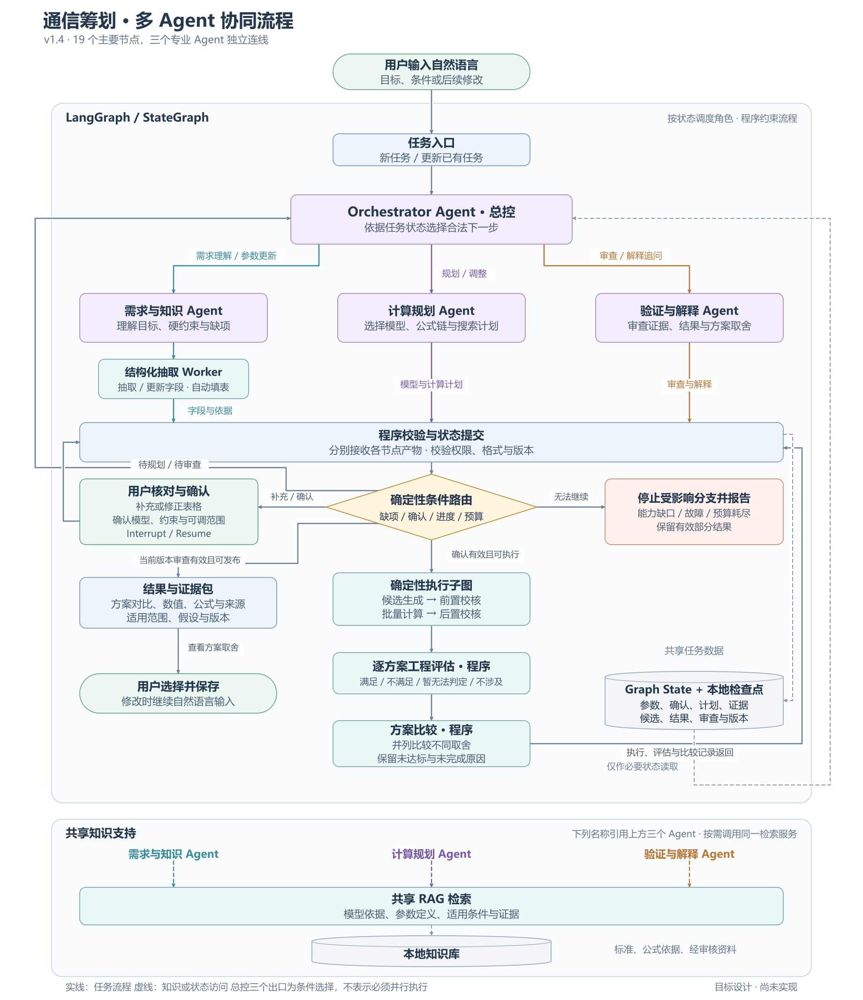

# 通信筹划系统：工程需求基线

基线版本：R2，2026-09-17。历史图稿版本：v1.4。H0 已批准工程施工；旧 P1 作为已测试基线接纳，新流程尚待逐项验收。阶段证据见 [P1 报告](../reports/stages/p1-applicability.json)；本文件是需求基线，不是完整系统验收报告。

本基线汇总用户已确认的决定，以及使其能够实施和验收所必需的工程补充。后续在现有 signal-formula-rag 内逐项实施，不另起一套应用。新授权的用户要求优先；科学事实与模型适用性仍需专业证据支持。

## 1. 文档入口与版本关系

- **当前施工规范：用户指定的 v3 交接规范、WBS 与已批准的 [工程计划](codex/MASTER_IMPLEMENTATION_PLAN.md)、[Contract](codex/CONTRACTS.md)、[任务清单](codex/TASK_BACKLOG.yaml)。** 本文保存研究需求及职责迁移；具体实施顺序使用 T001–T035。历史 P0–P7 编号不等同于新计划的 Phase。
- **当前目标流程：[v1.4 图稿与说明](diagrams/2026-09-15/通信筹划协同流程_v1.4.md)。** 包含 19 个主要节点，三个专业 Agent 的调度、提交和检索箭头分别绘制。
- [目标流程矢量图](diagrams/2026-09-15/通信筹划协同流程_v1.4.svg)与[Mermaid 源码](diagrams/2026-09-15/通信筹划协同流程_v1.4.mmd)供继续编辑。知识支持区的 Agent 名称是引用标签，不是另外三个 Agent。
- [科学审查](superpowers/specs/2026-09-14-scientific-review-design.md)保留为缺陷与专业依据清单；仍有效的角色、状态和工具协议统一记录在本文。
- [当前运行交接](../HANDOVER.md)和[现有程序流程](system-flow.md)说明旧程序事实，不能用目标图推断能力已经实现。
- 已按用户要求移除被本基线替代的旧设计、旧协作交接和旧图稿；只保留当前需求与图稿，以及仍需使用的科学审查、实施计划和验证证据。删除清单见[清理记录](../reports/docs_cleanup_2026-09-15.json)。
- 原上传文件和参考 Excel 保留，文件中的命令、示例参数及目标指标不自动成为实施授权、运行默认值或验收结果。

## 1.1 R2 范围与职责迁移（H0 批准）

首个演示按 T019 验收自由空间单链路的正常、缺参、工具失败耗尽及修改参数失效四条路径；冲突、取消与过期确认仍是其他必要验收，不替代这四路。完整 WBS 的链路预算、接收功率和余量保留在 T024。特殊传播模型未经登记与科学依据审核时报告能力缺口。原 VSDX 与既有流程图保持原样，图中的历史命名通过下表解释。

| 历史职责 | 新职责归属 | 保持的程序边界 |
|---|---|---|
| 需求与知识：需求、参数、检索证据 | 需求与规划 | 参数仍是建议，用户通过确认门生成正式快照 |
| 计算规划：方法选择、公式依赖、输入绑定 | 需求与规划 | Schema、模型准入与计划 DAG 由程序校验 |
| 计算规划：请求已批准步骤执行 | 专业计算 | 确定性 Service 读取快照计算，角色不能改数值 |
| 总控调度建议 | Orchestrator | Router 根据合法状态和预算执行 |
| 验证与解释 | 验证与解释 | 硬校验与最终发布门保持独立 |

有限候选生成、设备选型与优化比较仍是研究需求；当前 T032 比较固定流程、单 Agent、多 Agent 三种执行模式，不等同于完成有限候选搜索产品。超出已批准任务的研究功能需另行规划，不能在验收时删掉或宣称实现。

科学公式章节保留目标规范；当前七条公式与 92.4 近似按既有版本执行。T031 的独立科学审查必须给出依据，任何执行公式变化都需显式版本升级与基准，不可在角色迁移时悄悄换算式。

## 2. 用户已确认的要求

| 编号 | 要求 | 范围解释 |
| --- | --- | --- |
| R01 | 通信传播与链路预算起步，最终生成并比较候选方案 | 历史研究首版目标是比较同一任务下的参数组合；当前施工边界见 §1.1，具体设备库后接，实际传播模型逐项扩展 |
| R02 | 必须使用多 Agent 和 LangGraph | 一个 Orchestrator Agent，加需求与规划、专业计算、验证与解释三个专业 Agent |
| R03 | 用户自然语言输入，系统自动解析填表 | 保留原文；目标、环境、参数与候选模型自动回填；用户只需核对、修正和补充 |
| R04 | 计算目标和传播条件可以由模型提出判断 | 必须附依据，程序校验，用户可纠正；模型不能把未知条件当作已确认事实 |
| R05 | 输出专业数值由程序产生 | 包含公式、选择依据、来源、缺项；满足条件时输出可复核数值，不采用 LLM 自报数值 |
| R06 | 参考 Excel 不计入系统运行知识 | 仅用于开发复核；不进入检索、页面公式来源、默认参数或自动确认 |
| R07 | 缺少的信息询问用户 | 不从原表补相对速度、温度、损耗或其他事实，不用 0 表示未知 |
| R08 | 用户限定可调频率、功率、天线等参数范围 | Agent 在该范围内规划，程序生成组合；不改固定事实，不自动放宽硬约束 |
| R09 | 满足约束的方案并列展示不同取舍，用户选择 | 不自行设定综合评分权重，不冒称单一指标最优就是综合最优 |
| R10 | 公式以编译后的 LaTeX 展示 | 公式全集另设折叠区，结果后链接定位集合，支持返回原结果 |
| R11 | 全篇符合科学规范 | 审查七条既有公式、变量和单位、参考面、适用范围、负值语义、数值显示与来源 |
| R12 | 开源、本地、无付费 API，成熟后支持离线运行 | 运行链不要求账号、云数据库或云日志；离线资源与迁移包单独验收 |
| R13 | 问题和回答可保存为 JSON，并有仅问题的案例文档 | 保存原文、确认输入与程序结果；不同版本与未完成原因可追溯 |
| R14 | 先规划，再按项目逐项完成 | 优先消除科学与输入流程问题，再接多 Agent 与方案比较；H0 已批准后按 T001–T035 执行，验收证据逐项登记 |
| R15 | 历史审计阶段限制真实调用，后续按已批准测试任务验证 | 规则与夹具先行；T028 验证真实界面确认，T030/T032 单独记录真实本地模型调用和预算 |

“0 成本”在本项目指没有新增软件订阅和付费 API 费用，不等于硬件、时间和用电没有成本。软件、模型和参考资料分别记录许可证；公开可下载的标准正文不自动变为 MIT 内容。既有 Windows/驱动不是本项目新增的开源软件成果。

## 3. 本次补齐的工程规则

下表是为落实上述要求补充的可执行规则，不伪装为用户逐字指定的实现细节。

| 编号 | 补充规则 | 解决的问题 |
| --- | --- | --- |
| E01 | 区分知识解释、给定参数计算、候选方案比较三类任务 | 只问公式含义时不强迫填搜索范围；只有一个配置也能计算 |
| E02 | 表单区分固定事实、可调变量、硬约束、比较指标、模型与假设、未知项 | 防止把“求余量”当成“余量必须大于 0”，或把已知参数当可优化变量 |
| E03 | 计算前确认一次当前任务快照，范围内候选不逐个确认 | 将解析与确定性执行分离，保持批量计算可用性 |
| E04 | 首版使用明确的有限候选集合，范围输入需明确端点、单位与步长 | 避免偷偷选择采样密度、无限搜索或把抽样说成穷举 |
| E05 | 执行状态、模型适用性、工程达标状态、搜索覆盖分别记录 | 不把计算成功、未知条件、预算耗尽和达标混为一谈 |
| E06 | 正式结果要求当前版本的审查与程序发布检查 | 防止批量计算后绕过验证 Agent，或用旧审查发布新方案 |
| E07 | 语义变化使受影响确认与产物失效；重复点击、过期响应和恢复均检查版本 | 防止旧题参数残留、重复计算及旧结果覆盖新结果 |
| E08 | Agent 提交引用与建议，程序生成正式工具请求并提交受保护状态 | 防止模型通过工具参数或 State 更新绕过数值限制 |
| E09 | 本地最小任务记录自动持久化，导出 JSON 仍是单独操作 | 同时满足中断恢复和用户可保存记录；不声称所有旧查询已自动落盘 |
| E10 | 调用、候选数、公式执行次数和主动耗时分别计量并设上限 | 一个“批量工具调用”不能隐藏无限计算；重试和重新规划不重置预算 |
| E11 | 只比较同一任务、评估口径和有效版本下的方案 | 防止不同模型假设、统计口径或过期结果被直接排成同一优劣表 |
| E12 | 新增模型走离线可追溯审核与版本化登记 | 雨天触发重新规划与补问，不允许 Agent 临时修改公式或执行检索文本 |

## 4. 任务与用户交互

### 4.1 统一入口

用户输入自然语言后，程序记录原文与任务版本，识别当前任务类型。需求与规划 Agent 结合原文和检索依据组织字段；结构化抽取 Worker 提出数量与语义绑定，程序核实后形成可编辑草稿。

表单将“补充参数”“修正识别”和“公式选择”合为常显核对区。数值与单位分列，原文依据、来源状态和缺项提示就近显示。只展示当前模型和计算链需要的字段，不要求用户填写整张空白大表。多目标使用列表；不同候选模型各自显示所需条件与覆盖范围。

用户手动填写的值同样需要类型、单位、语义和适用性检查。修改原文、参数、模型或范围后显示差异；换题重置旧题的手动覆盖。参数之间的关系不清时保留冲突，不凭最后出现的数字覆盖。

### 4.2 确认边界

“确认并计算”绑定任务版本、规范输入、模型和公式版本、关键假设、硬约束、可调域、候选生成规则、计划与知识快照哈希。模型建议与用户确认事实分开保存。来源可靠的定义常量和确定性派生量记录依据，无需用户逐项确认。

确认后不再调用 LLM 重新解释正式数值。纯格式修复不改变确认语义；参数、方法、参考定义或约束变更则必须使旧确认失效。用户补充只更新相关字段，不能无故要求重输已知的整道题。

### 4.3 用户海上例题的预期处理

问题：岸站到海上平台，频率 4.5 GHz，距离 30 公里，求传输损耗。

自动填入频率 4.5 GHz、距离 30 km、岸海环境和待求传输损耗。提示应当是：“已识别频率和距离。请明确需要自由空间基准还是实际场景传播估计；当前已登记传播能力不能覆盖实际海面反射等影响。”不能只显示“缺少适用条件”，也不能再索要已识别的频率、距离。

用户明确选择自由空间基准后，按已确认模型计算并标注基准范围。要求实际传播而无对应工具时，报告模型能力缺口；不要先索要一长串本版本无法使用的参数。

## 5. 多 Agent 与 LangGraph 职责

| 角色／组件 | 产物与权限 |
| --- | --- |
| Orchestrator Agent | 从程序给出的合法动作中选择角色和恢复方向；不修改事实、工具数值、硬规则、权限和预算 |
| 需求与规划 Agent | 目标、语义、缺项与证据；提出已登记方法、公式依赖与输入引用的计划，不能确认参数或生成正式数值 |
| 专业计算 Agent | 对已确认计划提出受控工具调用，只引用 plan_step_id、snapshot_id 和版本；请求数值由服务端解引用，不自由规划、填写数值或更换公式 |
| 验证与解释 Agent | 检查遗漏、证据和解释一致性；输出可定位的问题与说明，不覆盖程序失败或数值 |
| 结构化抽取 Worker | 原文绑定与字段更新；不是额外独立决策 Agent，若调用本地模型也必须计入预算 |
| 程序编排与状态提交 | Schema、引用、权限、版本、路由、确认、幂等与预算检查；保护正式参数和结果 |
| 确定性执行子图 | 候选生成、前置校核、公式计算、后置校核；计算器不再做隐式解析或模型调用 |
| 工程评估与比较程序 | 按有效工具结果检查硬约束、形成同口径对比；保留不达标、未知和执行失败原因 |
| 共享 RAG 与本地资料 | 按需提供依据、定义、适用范围和版本；检索相关不等于模型适用或工具已实现 |

四个 Agent 可共用一份本地模型权重，以独立上下文、工具权限和结构化产物协作；不要求同时加载四个模型。不同上下文不能当成独立的数学或科学证明。动态调度是实际角色行为，不能仅给原有函数换 Agent 名称。

### 5.1 流程实现约束

主流程使用 LangGraph StateGraph；共享 Graph State 是数据。各 Agent 先返回本角色报告，经程序校验才可提交正式字段。reducer 负责合并方式，不代替角色权限与专业检查。总控的三条边采用受检查的条件路由，不实现为三条无条件静态边；不要在同一节点混用会同时执行的静态出口和动态跳转。[LangGraph Graph API](https://docs.langchain.com/oss/python/langgraph/graph-api)

程序路由依次处理：非法／过期产物、取消或预算耗尽、能力缺口、待解析或待规划、缺项或待确认、可执行、待审查、可发布。这里只规定优先关系；实现时针对当前阶段互斥选择，不依赖一个含糊的“完成”字符串。

候选计算 → 工程评估 → 方案比较 → 校验入状态 → 总控调度验证与解释 Agent → 校验审查产物 → 程序检查发布条件。审查提出阻断问题时转具体补问、受限恢复或停止。审查无阻断问题也不等于现场通信保证。

现有 Engine.query 同时包含解析、检索、模型调用、计算与目录刷新；新执行子图不能直接把它当纯计算 Tool。逐步抽出可复用服务，并固定一次执行的知识、公式与规则快照。旧接口保持明确的兼容模式，不冒充新版工作流。

### 5.2 发布规则

- 给定参数计算：当前确认、适用性与数值检查有效，已请求量有完整状态，并有当前版本有效的审查记录。
- 方案比较：再要求候选清单、搜索覆盖、逐方案工程判定和比较记录；未完成部分明确标记。
- 知识／解释问答：要求证据和审查，允许复用有效历史结果；无关计算不构成前置条件。
- 缺项、能力缺口、预算耗尽和工具故障提示由程序及时展示，不等待 LLM 才能报告错误，也不能标成正式成功方案。
- 页面专业数值、单位、公式与达标状态直接绑定程序产物；解释引用结果 ID，不从模型自由文本提取数字作为正式值。

## 6. 候选生成、工程评估与比较

### 6.1 有限搜索

固定参数不可改动；可调参数必须有用户确认的候选值，或明确范围及步长。范围规范化、端点规则和组合去重由程序完成；先显示预计组合数和搜索范围。候选生成按稳定顺序，候选 ID 绑定参数组合、模型和版本。

缺少步长或候选值时，先给可编辑的搜索规则让用户确认，不自动选择采样密度。组合超过资源上限时提示缩小范围或确认明确的分批／抽样策略；不得静默截断后宣称已穷举。涉及抽样须记录算法版本、随机种子、样本数及未覆盖范围。

单一已知配置视为单个候选；仅知识问答不生成候选。同一候选内部按公式依赖排序；不同候选可以独立执行，但不能因“多 Agent”要求强制并发。历史研究首版目标为单链路、同一已确认评估口径内的组合比较；当前施工范围按 §1.1 区分，不把 T032 执行模式实验当候选比较产品。

### 6.2 状态与判断

| 维度 | 应记录的内容 |
| --- | --- |
| 执行状态 | 未执行、运行中、完成、部分完成、失败、已取消、中断；失败记录不保留可误用的正式数值 |
| 适用性状态 | 已检查范围内适用、不适用、条件未知；应同时写明检查覆盖和未验证假设 |
| 工程状态 | 满足、不满足、暂无法判定、不涉及；仅依据有效结果与明确约束 |
| 搜索覆盖 | 计划候选总量、已生成、已计算、失败、未知、未执行与原因；不得只报告达标条数 |

至少一个必需约束已有有效的不通过依据时可判“不满足”；既无有效失败依据，又有必需条件未知时为“暂无法判定”。没有要求工程约束判定的纯数值任务为“不涉及”。负 dBm 不是天然错误；负余量需按约束解释。

### 6.3 对比与选择

先展示满足硬约束的候选及发射功率、计算余量等有依据的差异，其他状态单独保留原因。允许用户选指标排序；不默认综合权重或设备成本，不把发射功率直接当整机耗电。不同模型、参考面、统计含义或适用范围的候选不能不加说明混排。

如果没有达标方案，报告搜索集合与主要约束缺口。只有完整检查了明确的有限集合，才可声明“此集合内没有达标方案”；预算内没找到不等于所有可能方案无解。

选择方案时由服务端校验候选 ID、版本与有效状态并保存，不重新调用模型。后续接设备库时再增加设备兼容和相应规则证据，不能用当前参数比较代替设备可部署性结论。

## 7. 科学公式与数值规范

### 7.1 先修既有七条公式

范围为 fspl_ghz、doppler_max、thermal_noise、noise_density、receiver_threshold、received_power、link_margin。逐条核查量的含义、单位、参考面、对数参考量、数学定义域、物理适用条件、计算依赖、资料定位和独立基准。verified 是项目审核状态，不是全面科学认证。

FSPL 新版本以单位一致的基本关系作为执行表达式：

\[
L_{\mathrm{bf}}/\mathrm{dB}
=20\log_{10}\!\left(\frac{4\pi d f}{c}\right).
\]

这里 d、f、c 使用相容单位，对数自变量无量纲。定义光速在受审核常量表中登记。原式、工程近似式和执行式分别保存，不能只改变展示公式而继续计算旧表达式。92.4 是单位换算后的工程近似表达，不是没有来源的错误常数；切换基本式必须升级公式版本和基准，不改写旧 JSON。[ITU-R P.525-5，§2.3](https://www.itu.int/dms_pubrec/itu-r/rec/p/R-REC-P.525-5-202411-I!!PDF-E.pdf)

负 FSPL 等异常需要适用性诊断，不能取绝对值或截为 0。简单下限检查不是远场充分条件。多普勒频移和多普勒损耗分别处理，缺损耗模型不能从频移临时编造 dB 值。

噪声路线区分源温度、接收机等效噪声、系统温度与标准参考温度；噪声是否已计入必须明确。比特率和噪声带宽不互换，dB/dBi/dBd 不能无条件视作同一语义。

### 7.2 显示精度

保留原始输入串与尾零，规范值用于计算；中间运算不主动按页面精度舍入，但不把浮点运算描述成无限精度。程序原值、显示值、单位和精度策略分别保存。阈值判定使用程序值及已登记的容差，不读取页面字符串。

沿用已讨论的**工程显示默认建议**：dB/dBm 保留 2 位小数（2 DP），普通物理量保留 4 位有效数字（4 SF），极小非零量用科学计数法。它是可配置显示策略，不是统一科学标准，也不代表测量精度或不确定度。正式采用时登记策略版本；若专业方法另有精度要求则遵循其说明。

### 7.3 特殊环境与新增公式

“下雨”等新条件触发模型覆盖检查和重新规划。先确认已登记且兼容的传播方法，再询问该方法实际需要的参数，并使旧假设和确认失效。模型若已含某效应，不重复叠加损耗。无方法时明确能力缺口。

例如 ITU-R P.838-3 描述雨致单位长度衰减；得到整条链路的衰减还需明确路径方法、数据、参数和统计口径，不能仅因识别到“雨天”就增加一个固定 dB 数。[ITU-R P.838-3](https://www.itu.int/dms_pubrec/itu-r/rec/p/R-REC-P.838-3-200503-I!!PDF-E.pdf)

新增或修订公式进入 draft，经来源、单位、适用性、程序安全及独立数值基准检查，再由有依据的审核记录准入。旧版保留复现所需内容；发现错误可撤销其未来执行资格并标注受影响记录，不能把“版本冻结”解释为不能修正缺陷。检索资料中的指令不作为工作流命令。

## 8. 状态、存储与资源边界

### 8.1 最小结构化产物

本节保留 R1 的概念字段说明；旧 task_revision、ToolRequest 等名称不另立一套可执行 Schema。T005 以 Contract v1 的 revision、CalculationRequest 等字段和必填集为准，保留运行身份与尝试追踪的语义，不能直接拼接两套必填字段。

| 产物 | 必需信息 |
| --- | --- |
| ParameterRecord | 数量类型、原文位置、原值/原单位、规范值/单位、来源、确认、有效性、参考定义、版本和依赖 |
| TaskState | 任务类型、目标、参数引用、假设、计划、确认、结果与审查引用、阶段、预算、错误与版本 |
| CalculationPlan / CandidateSet | 公式及工具版本、输入与上游引用、依赖 DAG、硬约束、搜索域/生成规则、候选身份及覆盖 |
| ConfirmationSnapshot | 用户确认的任务和草稿版本、输入/计划/搜索规则哈希、模型和知识快照 |
| AgentReport | 实际角色身份、报告类型、任务版本、简短依据、建议动作及引用；角色身份由程序绑定 |
| ToolRequest / ToolResult | 请求身份、工具与公式版本、输入快照/引用、规范数量、执行状态、诊断、幂等键 |
| Review / ResultPackage | 审查对象与版本、发现和解决状态、程序数值、来源、假设、工程状态及候选比较 |
| Trace / Export | 事件、节点、模型与配置、耗时、用量、恢复关系；原题、补充、确认、实际结果与选择记录 |

正式工具请求由程序解引用已确认参数、登记常量和合法派生量后构造。Agent 提交 parameter_refs/result_refs，不自由填写正式数值。Schema 拒绝未知字段、布尔冒充数字、NaN/Infinity、非法枚举和无效引用；格式合法之后仍需跨字段、版本和权限检查。

版本标识分别使用：task_revision 标识任务语义变化，state_version 标识正式状态提交，plan_hash 标识计划内容，run_id 标识执行或恢复运行，attempt_id 标识节点实际尝试。用户确认、执行请求和结果提交都必须核对相应版本；过期产物记录为 STALE_REJECTED，不覆盖当前状态。

ToolRequest 至少绑定 request_id、task_id、task_revision、run_id、node_id、attempt_id、plan_hash、confirmation_hash、tool_id/version、formula_id/version、input_refs/input_hash、knowledge_snapshot、rule_version、expected_output_schema 和 idempotency_key。ToolResult 回绑请求身份、实际输入及版本，每个数量包含 quantity_kind、raw_value、unit、reference_definition；失败信息存入诊断，不能在正式 value 中残留供下游使用的数值。

### 8.2 本地恢复与导出

本地检查点应可跨服务重启保存任务；不能只使用内存存储就声称支持恢复。持久化只读引用和不可变产物，状态更新与事件记录保持可对账；工具调用不放在长事务中。建议采用本地 SQLite 方案，具体 LangGraph 与检查点依赖在接入阶段锁定版本和许可证。

Interrupt 使用稳定任务标识，恢复前核对草稿和确认版本。暂停节点恢复时会从节点开头重执行，所以节点拆分、提交和工具调用必须幂等；不能把它当成从 Python 暂停语句后一行简单续跑。[LangGraph Interrupts](https://docs.langchain.com/oss/python/langgraph/interrupts)

重启后不自动重放未确认或过期任务。重复点击与晚到结果只接受一次有效提交；用户修改条件或取消后，旧执行即使返回也不得覆盖新状态。模型不可用时显示实际模式与故障，可保留确定性诊断功能，但不能冒称完成多 Agent 协作。

新模式为恢复自动保存最小本地任务记录，界面明确告知；用户“保存 JSON”导出可读证据包。导出从服务端记录生成，不接受客户端替换数值或任意写入路径。旧结果导出保留原版本，不能自动换用新公式复算。

任务历史提供查看和删除入口；删除仅影响用户所选任务的状态与产物，不删除知识库或手工另存的文件。实际删除、容量限制和重启恢复需在上线前验证。对外页面只显示必要的状态与简短依据，不输出模型隐藏推理或原始内部状态全集。

### 8.3 预算与实验

一次用户发起的执行周期累计计算模型调用、输入/输出 token、检索和工具调用、生成候选数、公式求值次数与主动耗时；用户等待单列。一个批量调用不等于一次公式求值。Agent 自动换计划、run_id 或版本不能重置周期余额；用户发起新周期才重新分配。缺失的资源计量标为未知，不能填写 0；临时失败只作有限重试，同一未解决问题不得通过反复换角色继续循环。

此前讨论中的“8 次模型、32 次工具、4800 输出 token、180 秒”等为实验初值，不能直接作为新候选批量执行的硬编码规模或已达成性能。接入时建立可配置的 BudgetPolicy，逐项给出上限和计量单位；缺少必要上限时不得启动无界执行。具体数值属于实测后确定的工程配置，不要求用户在每道题里填写。

固定工作流、单 Agent、多 Agent 作为同条件对照：使用相同模型、知识、工具、任务与预算口径。原文中的 30% 提升、90% 可用率等保留为历史研究目标；未定义分母、数据集与验收方法前，不当成本期验收承诺或既有成果。

## 9. 分项顺序与验收

下列是工作分解及完成标准。当前已完成 P0 文档基线和 P1 适用性修复，其余阶段尚待实施。每项形成证据后再进入依赖它的下一项；详细编码计划在该项开工前制定。

| 项目 | 范围与主要位置 | 完成标准 |
| --- | --- | --- |
| P0 需求入工程 | 本文、README、HANDOVER、现有/目标流程及旧稿版本说明 | 本轮完成文档同步；不改变运行能力 |
| P1 适用性与结果状态 | formula_rag/pipeline.py、拟增适用性模块、tests | 海上例题精确补问；异常负 FSPL 阻断；负 dBm 与负余量正确区分；噪声参考不明不放行 |
| P2 七公式与单位版本 | knowledge/formulas.json、catalog/core/importing/presentation | 基本式、单位/数量语义、独立基准与旧版本复现；公式显示和实际执行一致 |
| P3 数值显示 | 拟增 formatting 模块、presentation、JSON 与页面 | 显示策略独立；极小非零量不归零；工程判定不依赖显示舍入 |
| P4 解析填表与确认协议 | parsing/interpretation/pipeline、app.py、最小核对表与状态接口 | 先解析、再修正确认、最后计算；旧参数残留、版本冲突和重复提交有验证 |
| P5 LangGraph 多 Agent | 拟增 workflow 与 agents 模块、状态持久化、受控工具接口 | 四角色真实独立协议；条件路由、必经审查、预算、幂等、取消及恢复；本地框架依赖锁定 |
| P6 候选生成与比较 | 拟增候选生成、工程约束、比较模块 | 有限确认域、完整计数和原因、同口径比较、用户选择；不自动改约束或权重 |
| P7 页面整合与分层验收 | web、examples、scripts/evaluate.py、reports、问题文档与 JSON | 已有公式集合导航保留；当前流程与证据一致，分开报告真实模型和程序验证 |

[已完成的 P1 实施清单](superpowers/plans/2026-09-14-01-applicability.md)继续作为起点，执行前按本文复核。框架接入不得跳过 P1—P4 的科学和确认边界。

### 9.1 必须覆盖的验收案例

| 编号 | 输入／事件 | 预期行为 |
| --- | --- | --- |
| A01 | 岸海、4.5 GHz、30 km、求传输损耗 | 回填已知量，准确区分范围未确认与实际模型未覆盖 |
| A02 | 完整预算输入遗漏相对速度或某项损耗 | 只追问当前模型需要的缺项；不从参考表补 0，不索要无关字段 |
| A03 | 明确自由空间基准且参数齐全 | 先展示核对表，确认后调用新版本公式，保留单位与来源 |
| A04 | 修改文本、参数、模型或搜索域 | 失效受影响确认和结果；无前题隐藏值继承 |
| A05 | LLM 建议虚构数值、非法工具或改写结果 | 拒绝越权产物，不进入正式输入与输出 |
| A06 | 极短距离负 FSPL、负 dBm、负余量 | 分别判适用性异常、合法功率电平、按约束判余量不足 |
| A07 | 极小非零输出、余量接近阈值 | 科学计数法保留非零含义；按原值及登记容差判定 |
| A08 | 噪声参考不明、重复计入或带宽/比特率混用 | 阻止受影响计算，说明具体语义缺口 |
| A09 | “加入雨衰”，库内无适用工具 | 报能力缺口；不临时改公式，不捏造雨强和附加损耗 |
| A10 | 有效模型与完整有限候选域 | 程序生成、去重、校核并计算，所有固定参数不变 |
| A11 | 范围未给步长、组合超限或途中预算耗尽 | 请求明确搜索规则或报告未完成范围，不静默截断 |
| A12 | 多方案均达标／无方案达标／有候选未知 | 并列取舍或真实缺口；未知和失败不误标成达标或确定无解 |
| A13 | 工具结束但验证 Agent 尚未审查，或审查版本过期 | 不发布正式当前结果；程序诊断信息可正常显示 |
| A14 | “为什么余量不足”／选择已有有效方案 | 复用有效记录解释或保存选择，不无故重算 |
| A15 | 重复确认、过期响应、取消、暂停后重启 | 幂等提交；旧结果不覆盖；恢复前重验版本与依赖 |
| A16 | 导出新旧任务 JSON | 原题、确认、候选、公式/规则版本、程序数值和状态可复核 |
| A17 | 公式链接、集合折叠、参数核对区 | 能定位并返回，用户不用翻找分散的纠错控件 |
| A18 | 模型不可用、离线运行或缺依赖 | 报实际状态；不静默联网或将计算模式冒称多 Agent 成功 |

确定性结果使用独立基本关系、人工基准或经验证的其他实现作为期望值，逐一核对全部待求量与关键中间量，不能只检查最终余量。23 个历史样例的预设断言通过，不能代替上述验收；完整计算、正确追问、合理拒绝、错误拒绝、错误放行分别统计。

H0 之前的审计只核对已有 JSON、无模型测试与接口夹具。H0 批准后按 T028/T030/T032 的有界验收执行真实界面与本地模型验证。未来真实协作验收必须实际运行本地模型并记录角色调用，夹具通过不能冒称真实多 Agent 已通过。

## 10. 当前状态及尚需落实的选择

2026-09-15 最初文档同步时的只读检查确认：项目虚拟环境尚未安装 LangGraph；七条公式、现有查询和页面仍属旧流程。科学缺陷清单尚未修复。此次文档同步不构成程序验收，不重跑历史模型、浏览器或 82 项单元测试。

**需求范围已足够进入逐项设计，当前没有必须由用户再回答才能保存本基线的问题。** 下列选择在相应项目开工时完成，不擅自写成用户已确认：

| 选择 | 处理时间与规则 |
| --- | --- |
| LangGraph、检查点依赖的精确版本 | P5 锁定本地兼容版本、许可证和安装资源，不依赖云服务 |
| DP/SF 显示默认与特殊数量例外 | P3 按显示建议及七公式结果审查确定，标明其不是测量精度 |
| 最大候选数、批次、求值次数、时间与模型预算 | P5/P6 用本机实测制定配置；未实施前不承诺固定耗时 |
| 下一种真实传播模型及配套数据 | 另列专业模型项目；只有用户需求和来源/数据充分时接入 |
| 具体设备库、成本模型、覆盖或可靠性指标 | 后续明确范围与证据后加入，不隐含在本期参数比较中 |

首次入工程的验证记录见[工程文档同步检查](../reports/engineering_docs_sync_2026-09-15.json)，后续旧版本删除与当前引用检查见[清理记录](../reports/docs_cleanup_2026-09-15.json)。这些记录只证明相应时间点的文档、图稿与修改范围检查，不证明新功能已运行。
