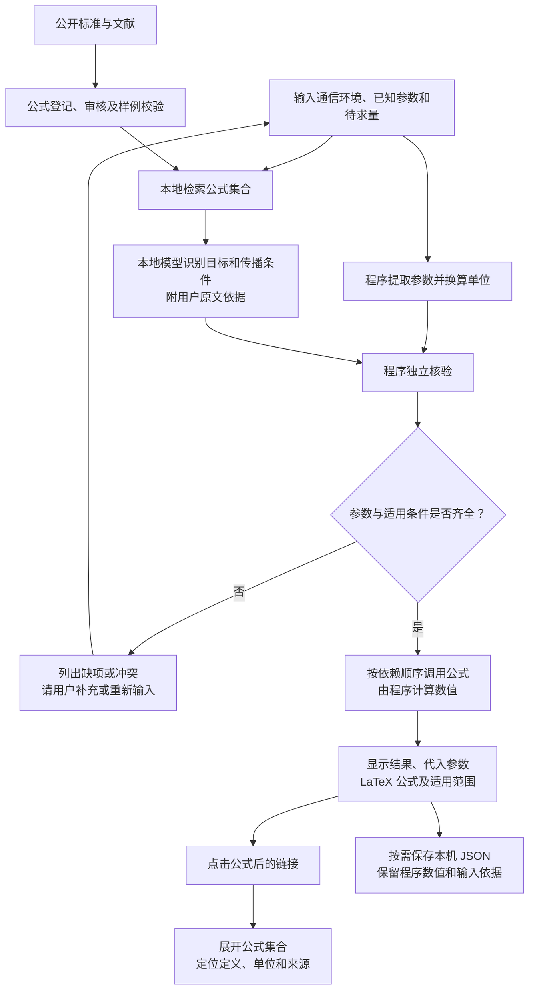

# 通信公式 RAG 流程图

## 当前目标：多 Agent + LangGraph

最新工程要求见[需求基线 R1](requirements.md)，当前目标采用[v1.4 图稿与说明](diagrams/2026-09-15/通信筹划协同流程_v1.4.md)。三个专业 Agent 的调度、提交和检索箭头分别绘制。图中流程尚未实现，不能与下方既有程序流程混为一谈。

## 既有程序流程：2026-09-14

版本：2026-09-14。参考表仅用于开发时核对结果；运行时不会读取原表补参数。

多个待求量分别检查，独立且条件齐全的结果可以先返回；其他项继续追问。计算不能使用模型生成的数值、公式或未明确的假设。缺少适用模型时明确说明能力缺口，不仅要求补数值。

## 各环节对应实现

| 环节 | 文件 |
| --- | --- |
| 参数解析与单位换算 | `formula_rag/parsing.py` |
| BGE 与词项混合检索 | `formula_rag/retrieval.py` |
| 本地 Qwen 结构化输出 | `formula_rag/model.py` |
| 原文依据、目标与条件核验 | `formula_rag/interpretation.py` |
| 依赖计算、缺项及部分结果 | `formula_rag/pipeline.py` |
| 白名单表达式求值 | `formula_rag/core.py` |
| 由计算表达式生成 LaTeX | `formula_rag/presentation.py` |
| 公式集合及定位交互 | `web/assets/app.js` |
| 本地公式登记 | `knowledge/formulas.json`、`formula_rag/importing.py` |

语言模型用于理解和选择，程序负责检查及计算。已明确的计算目标和用户手动纠正优先于模型建议；本地模型的推断会显示在结果中，不能保证任意自由文本都被正确理解。
